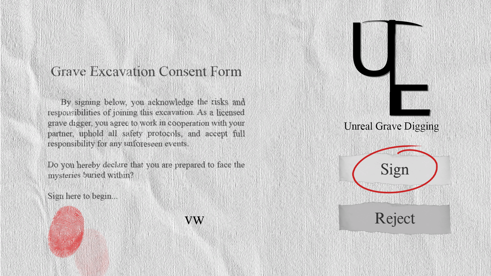
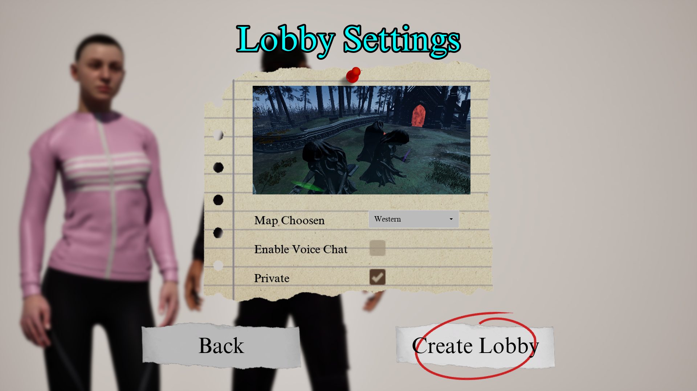
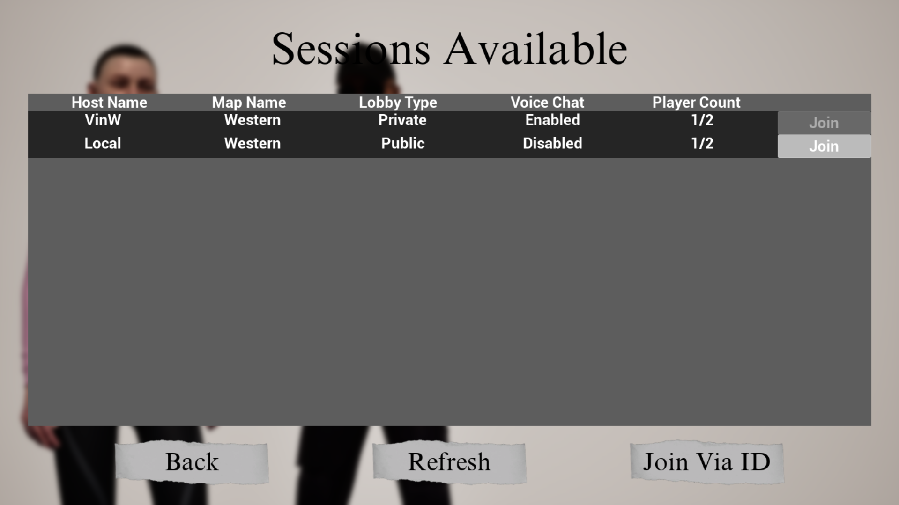
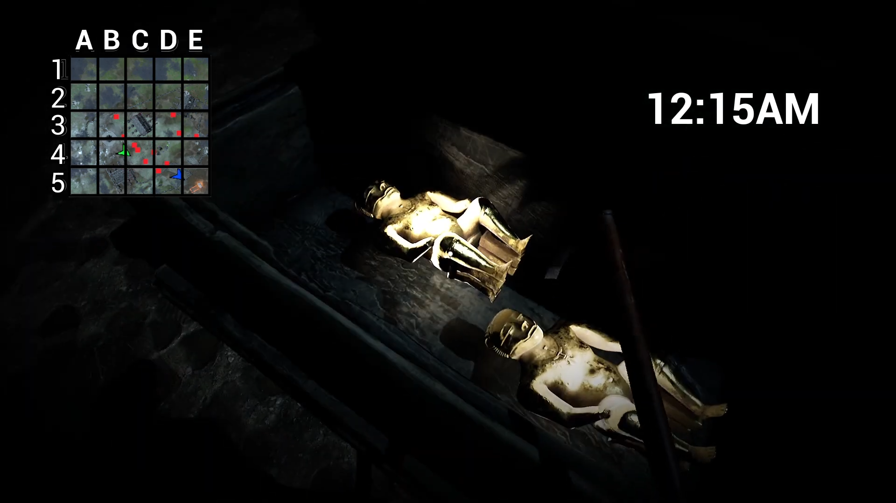
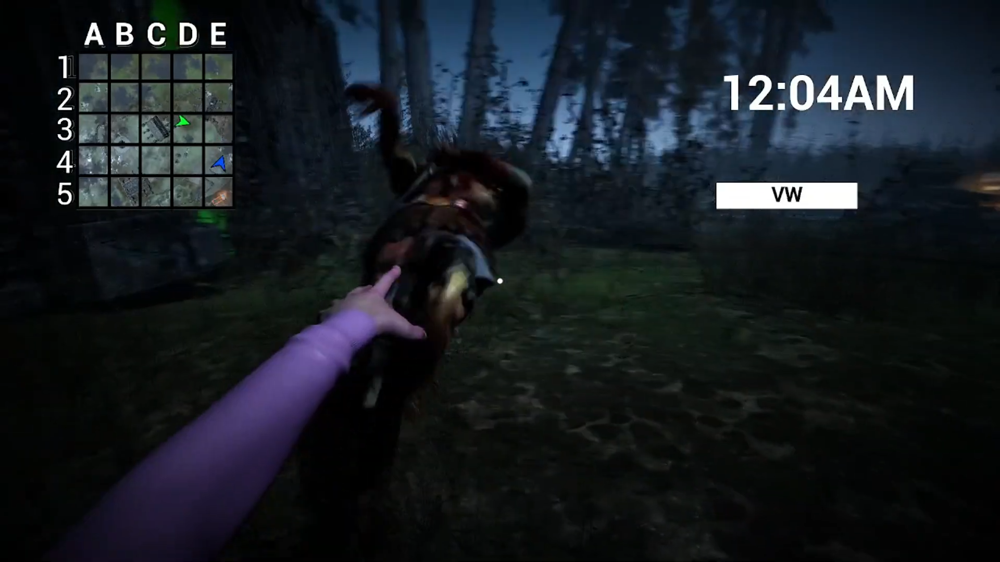
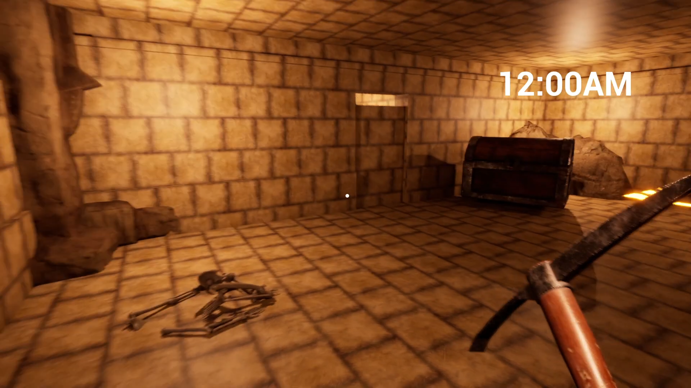
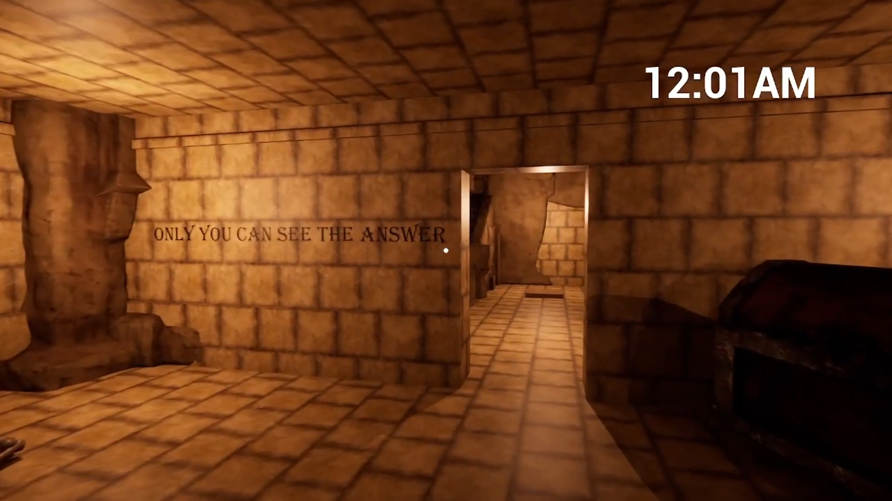
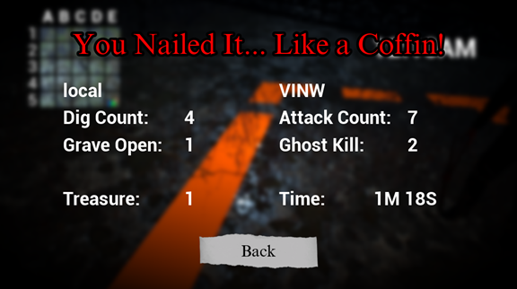

# Unreal Grave Digging

A cooperative 2-player multiplayer game built in **Unreal Engine**, where one player takes the role of a **Digger** and the other an **Attacker**. Work together to uncover treasures, fight off ghosts, and survive until extraction.

---

## 🔧 Features

- Co-op multiplayer gameplay (Digger & Attacker)
- Peer-to-peer connectivity via Epic Online Services (EOS)
- Replicated minimap with role-specific visibility
- Fully synchronized HUD using Common UI
- Treasure collection system with QTE interactions
- Puzzle-solving elements in specialized stages
- Seamless level transitions with Async Loading Screens

---

## 🖼️ Screenshots

### Main Menu  

### Lobby Create

### Lobby Search

### In-Game HUD (Digger View)  

### In-Game HUD (Attacker View)  

### Puzzle Stage (Tomb)  

   
  <strong>Digger View</strong>

 

   
  <strong>Attacker View</strong>

### Game Over / Victory

   

---

## 📽️ Videos

### 🎬 Trailer  

### 🎮 Full Gameplay  

